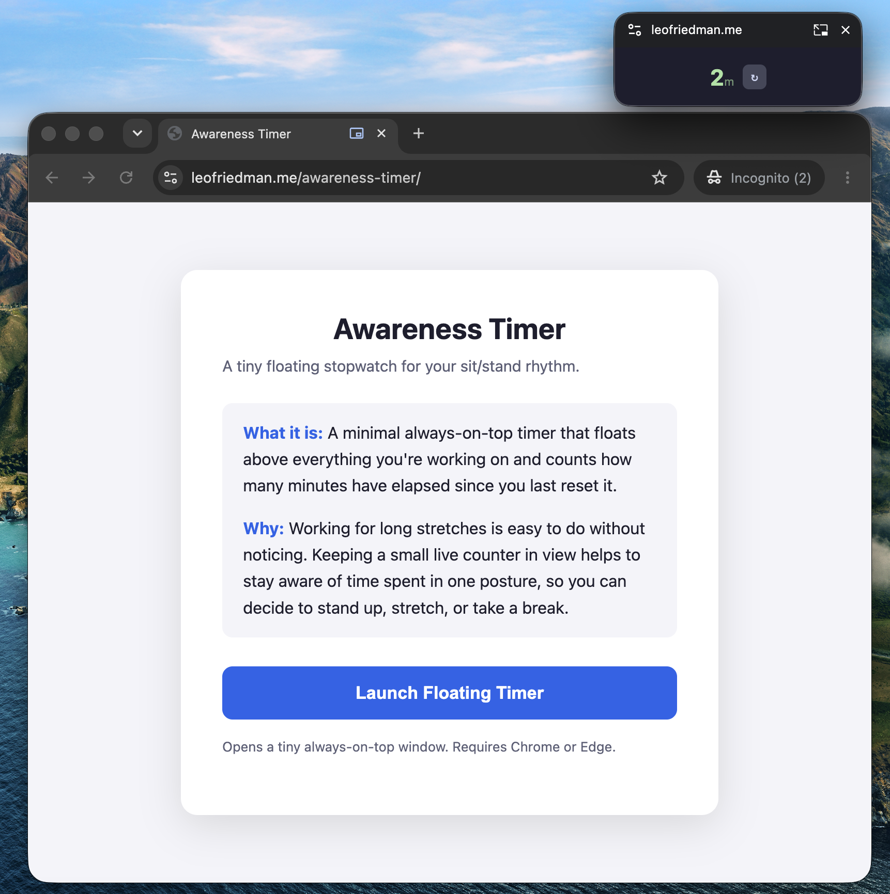

# Awareness Timer

A tiny always-on-top stopwatch that floats above your other windows and counts the minutes
since you last reset it. The point is not to time anything precisely, it is to keep a live
number in view so you notice how long you have been sitting in one posture.

## Running it

Visit [leofriedman.me/awareness-timer](https://leofriedman.me/awareness-timer) and click
**Launch Floating Timer**.

Chrome or Edge only. The Document Picture-in-Picture API is not available in Safari or
Firefox, and the page will tell you so instead of launching.

## Using it

The window shows elapsed whole minutes and a reset button (`↻`). The number changes color as
time accumulates: green under 25 minutes, amber at 25, red at 45. Click reset when you stand
up, stretch, or change position, and the next block starts from zero.

## Layout

Everything is in `index.html`: markup, styles, and the script that builds the floating window.
There is no build step and there are no dependencies.

If you edit it locally, avoid live-reload servers such as VS Code Live Server. The floating
window is owned by the page that opened it, so a reload destroys the timer mid-count.
